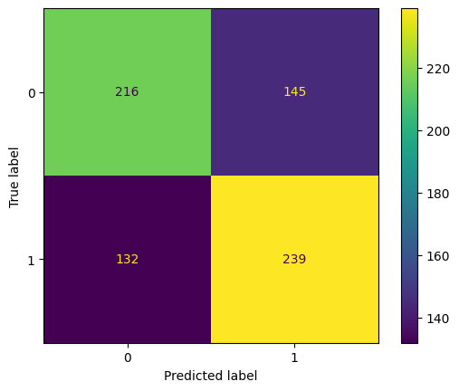

# CNN modelling in "EyeTism"

CNN modelling in EyeTism project was performed on individual heatmaps created for all the individuals (both TD and ASD) whose data have been collected from.

The individual heatmaps include the following different fixation based feature maps:

1) Fixation locations: points on an image where the gaze fixated

2) Fixation duration: the time during which the gaze fixated on a point on an image

3) Fixation saliency: the predicted (from DeepGazeIIE) saliency values of the fixated points on an image


After train-test split, the train set was composed of 6485 individual fixation maps and the test set of 732
 
Individual fixation maps have to be calculated by going through the following steps:

 1) Activate the environment
 ```BASH
    source .venv/bin/activate
  ```

2) Navigate to the folder named "scripts"
```BASH
   cd /scripts
   ```

3) Run the following command

```BASH
   python individual_maps.py
   ```
 
 4. Navigate to the folder where you will find them 

```BASH
 data/individual_maps
 ```

 5. Open the notebook "cnn_from_images_to_modeling.ipynb" in this folder


- No data augmentation technique was applied and it would be auspicable to check whether this implementation would provide better performances for both learning and prediction results 

## Results summary

- Trained models were all sharing a validation set size = 0.3
- Only some of the several models trained (after hyperparameter tuning) have been used for predictions
- Only the ones with better performances have been saved as .npy files
and used for subsequent binary classification 

## Best model: performance
The best CNN model architecture in terms of performance was 'Model4'. The tuned hyperparameters learned by the model are shown in the notebook named "cnn_from_images_to_modeling.ipynb"
 
      Recall: 0.62; Precision: 0.64; f2-score: 0.639

             Classification report - Test set
    ----------------------------------------------------  
              precision    recall  f1-score   support

           0       0.62      0.60      0.61       361
           1       0.62      0.64      0.63       371

    accuracy                           0.62       732
    macro avg      0.62      0.62      0.62       732
    weighted avg   0.62      0.62      0.62       732      


Confusion matrix
-----------------

